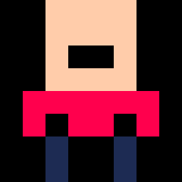

# Building a simple PICO-8 platformer with your AI agent + picopilot

> A hands-on tutorial for **driving a coding agent to build a PICO-8 game**. You bring the ideas and the judgement; your agent writes the Lua and draws the sprites; **picopilot is the toolchain that gives the agent what it otherwise lacks on PICO-8** — a way to count tokens, to actually *see* the pixel art it drew, and a verify gate to check each iteration.
>
> Every step below is real: the prompts you give the agent, the `picopilot` commands the agent runs, the outputs it gets back, and the points where **you** load the cart in PICO-8 to see it play. Where picopilot helped the agent, it says so; where v1-core still has gaps, it says that too.
>
> **The game:** a minimal platformer — a player that walks left/right, has gravity, and jumps, on solid ground and a couple of platforms. No enemies or score (noted as extensions at the end). It is deliberately small so the *workflow* is the star.
>
> **Agent-agnostic.** Any coding agent (pi, Claude Code, Codex, …) works. The concrete examples use **pi**.

## Why picopilot (the problem it solves)

Coding agents are genuinely good at PICO-8 *Lua logic* — movement, gravity, collision. Where they fail is everything that lives in the cart's **binary sections**, because the agent can't perceive it or safely edit it, and gets no feedback:

- **Token bloat.** PICO-8 caps code at **8,192 tokens**. An agent writes verbose Lua and blows the budget with no cheap way to see where.
- **Blind art.** Sprites are hex blobs. The agent "draws" without ever seeing the result, so pixel art comes out broken and it can't self-correct.
- **No feedback loop.** No way to check "is this cart well-formed and within budget?" each iteration.

picopilot turns each cart section into agent-friendly text and adds the feedback loop: `tokens` (see the budget), `gfx show/set` (edit sprites as a readable grid), `gfx render` (render the sprite to a PNG the agent can actually *look at*), and `verify` (a static gate). That is what this tutorial exercises.

## Setup

1. **Make your agent aware of picopilot.** picopilot ships its knowledge as agent skills. In your project, have the agent (or you) run:

   ```sh
   npx picopilot skills add          # installs the picopilot-* skills for your agent
   # or, for pi specifically, the skills are discovered from the project on start
   ```

   Now when you ask your agent to do PICO-8 work, it knows about `picopilot tokens`, the draw→render→fix loop, and so on, without you re-explaining each time.

2. **PICO-8** — the licensed fantasy console, to actually *play* the cart. picopilot v1-core does not yet ship `picopilot run`, so the "does it work?" checkpoints here are done by **you** loading the cart in PICO-8 by hand and telling the agent what you see. (That is a real gap, honestly flagged; the rest of the loop is complete.) Two easy ways to run the cart:

   **Option A — symlink the cart into PICO-8's carts folder, then load from inside PICO-8:**

   ```sh
   mkdir -p ~/.lexaloffle/pico-8/carts/examples/platformer
   ln -s "$(pwd)/examples/platformer" ~/.lexaloffle/pico-8/carts/examples
   ```

   Now the folder is live inside PICO-8 (edits to `main.lua` show up on reload) and you can `load examples/platformer/main.p8` from the PICO-8 prompt.

   **Option B — run headless from the terminal in one shot:**

   ```sh
   pico8 -run examples/platformer/main.p8
   ```

   Either works for the checkpoints below; Option A is nicer for iterating, Option B is quickest for a single check.

3. **`shrinko`** (optional, but needed for `picopilot tokens` and `picopilot verify`). The cleanest install is with **uv**, because it puts a `shrinko8` entry-point on your `PATH` — which is exactly the first thing picopilot looks for:

   ```sh
   uv tool install shrinko
   ```

   (This also pulls in Pillow, which shrinko uses for PNG conversion.) Without shrinko, `tokens`/`verify` return a structured "install shrinko" result instead of a number; scaffolding, sprite editing, and rendering all work regardless.

   > **A real gotcha worth knowing:** picopilot tries `shrinko8` on `PATH` first, then falls back to `python3 -m shrinko8`. On a machine with Python but no `shrinko8` module, that fallback fails with `shrinko-failed` (raw "No module named shrinko8") rather than a clean "not installed" message. Installing via `uv tool install shrinko` avoids this entirely by providing the PATH entry-point. (picopilot's own notes already flag this rough edge as a future refinement.)

---

## Step 1 — Ask the agent to scaffold the cart

**You:**

> Scaffold a new PICO-8 cart for a platformer in `examples/platformer/`.

**The agent runs:**

```sh
picopilot init examples/platformer
```

```
dir: .../examples/platformer
files[4]: main.p8, main.lua, AGENTS.md, picopilot.json
tips[2]:
  - Skills: make your agent discover picopilot's skills with `npx picopilot skills add` ...
  - Version control: this folder is not a git repo. Run `git init` yourself if you want one.
```

What the agent now has to work with:

- **`main.p8`** — the cart. Its `__lua__` section is just `#include main.lua`, so the agent edits plain Lua and never hand-writes the binary sections.
- **`main.lua`** — the source the agent edits. It starts with the standard PICO-8 loop:

  ```lua
  function _init() end
  function _update() end
  function _draw()
    cls()
    print("hello picopilot", 36, 60, 7)
  end
  ```

- **`AGENTS.md`** — a generated PICO-8 reference (API, the 16-colour palette, the memory map, token discipline). This is the highest-leverage part: the agent loads it as context, so it writes correct PICO-8 from the first try instead of guessing the API.
- **`picopilot.json`** — per-cart config (e.g. `allowMapOverlap`).

Notice the agent did **not** mutate your environment — no `git init`, no global installs; it printed tips instead. That "instruct, don't mutate" stance means you stay in control of your repo and your agent's skill dirs.

### Checkpoint 1 — you run it in PICO-8

Before any game code, load the scaffolded cart to confirm it opens cleanly (catching any format issue early, before the agent builds on it).

> **Your turn:** run it either way above, e.g. `pico8 -run examples/platformer/main.p8`. You should see `hello picopilot` on screen. Tell the agent whether it loaded.

**Result (real):** ✅ The cart loaded and showed the greeting. This confirms the `.p8` format picopilot scaffolds is correct, so it is safe to build on. Onward.

---

## Step 2 — Ask the agent for the movement logic

This is the part agents are *good* at: PICO-8 Lua logic. You describe the game feel; the agent writes it.

**You:**

> In `main.lua`, make a platformer: a player that walks left/right with the arrows, has gravity, and jumps with Z. Add solid ground and a couple of platforms. Use a placeholder rectangle for the player for now — we'll draw a real sprite next. Keep it token-conscious.

**The agent writes `main.lua`** — a small state table for the player (position, velocity, facing), a list of platform rectangles, and an `_update` that does input → gravity → move-and-resolve-collision on each axis, plus an `_draw` that paints the platforms and the player. (See the committed `main.lua` for the full ~90 lines; the shape is the classic "apply velocity, then push out of anything you overlap" per-axis resolution.)

The key PICO-8 details the agent got right *because the scaffolded `AGENTS.md` gave it the API*:

- `btn(0)`/`btn(1)` for left/right, `btn(4)` for the jump button (Z/C).
- Per-axis collision resolution (resolve X, then Y) so you can slide along walls and land on platforms cleanly.
- `mid(0, p.x, 120)` to clamp the player on-screen.
- `cls(1)` (dark-blue) background, `rectfill(...,4)` (brown) platforms, `rectfill(...,8)` (red) player — colour indices straight from the palette in `AGENTS.md`.

### The agent checks the token budget

Before handing it back, the agent runs picopilot's budget check — the thing it otherwise has no way to see:

```sh
picopilot tokens examples/platformer/main.p8
```

```
tokens: 359
pct: 4
chars: 1725
compressed: 903
budget: 8192
overBudget: false
```

**359 / 8,192 tokens — 4%.** Loads of headroom, as expected for a simple platformer. The value here isn't the number for a tiny cart; it is that on a *real* cart the agent now catches "you just blew the budget" the moment it happens, instead of discovering it when PICO-8 refuses to save. (When a cart goes over, `tokens` emits a call-to-action to `picopilot minify` — a v1-rest command.)

### Checkpoint 2 — you play the movement

> **Your turn:** run `pico8 -run examples/platformer/main.p8` (or reload in PICO-8). You should be able to walk the red square left/right, and jump with Z. It should fall under gravity, land on the ground and the platforms, and not fall through them or walk off-screen.

**Result (real):** walking, gravity, and landing all worked — but **the jump couldn't reach the platforms.** The player couldn't get onto the first platform from the ground, and the second was hopelessly out of reach.

### Tuning from real feedback (a design fix, not just a number)

This is where driving the agent pays off: you report the *feel*, the agent reasons about the *physics*. The agent worked out the jump height from the constants:

> jump height = `jump_vel² / (2 · gravity)` = `4² / (2·0.4)` = **20 px**

…and the platforms were spaced further than 20px above each other, so no amount of "try again" would clear them. Two options: crank `jump_vel` (risking a floaty, moon-like jump), or **re-space the level to the jump you already liked.** The agent chose the latter (better game design) plus a *small* jump bump:

- Platforms re-spaced into a **climbable staircase**: ground → step 1 → step 2 → step 3, each ~18px above the previous foothold.
- `jump_vel` nudged `-4 → -4.5` (height ~25px), giving ~7px of margin over each 18px gap — reachable, still snappy.

After the edit, the agent re-ran `picopilot tokens` (a good habit — check the budget after *every* change): **364 tokens, still 4%.**

### Checkpoint 2b — you re-test the staircase

> **Your turn:** reload and try to climb ground → step 1 → step 2 → step 3. Each gap should be a single satisfying jump.

**Result (real):** ✅ the full staircase climbs cleanly. Movement and level design done.

---

## Step 3 — Draw the player sprite (the "agent gets eyes" payoff)

This is the step picopilot exists for. An agent is **blind** to sprite hex: it can write `__gfx__` bytes, but it has no idea whether they look like a character or garbage. picopilot fixes that with two commands: `gfx set` (write a sprite as a readable char grid) and `gfx render` (render it to a PNG the agent can actually **look at** and correct).

**You:**

> Draw a little character for the player — a person facing right — and use it instead of the red rectangle. It should flip to face the way it walks.

### The agent draws sprite 1 as a char grid

Instead of hand-writing hex, the agent writes a *readable* 8×8 grid (`.` = transparent, `0-f` = the 16 palette colours):

```sh
picopilot gfx set 1 "..ffff..
..ffff..
..f00f..
..ffff..
.888888.
.8.88.8.
..1..1..
..1..1.." examples/platformer/main.p8
```

(`f` = peach, `8` = red, `1` = dark-blue, `0` = black — straight from the palette in `AGENTS.md`.)

### The agent RENDERS it and LOOKS — attempt 1

```sh
picopilot gfx render 1 examples/platformer/main.p8
# png: examples/platformer/main-sprite-1.png  (256x256, upscaled, palette-accurate)
```

The agent opens that PNG and sees:



**Not good — and the agent can now SEE why.** The head is a floating peach block; the "eyes" row `..f00f..` rendered as one wide black letterbox slot, not two eyes; the body reads as a lopsided bar with notches. *None of this is visible in the hex.* Without `gfx render`, the agent would have shipped this thinking it was fine.

### Attempt 2 — fix what it saw, render again

The agent widens the head, separates the eyes, cleans the body, and re-renders:


Better (one eye now reads as a real socket), but *looking* reveals new problems: only **one** eye shows (the other merges into the black background because the face isn't wide enough to frame it), and the figure is shoved left and lopsided. The lesson the agent learns by seeing: **eyes must be fully surrounded by face colour to read as eyes, and the figure should be centered in the 8×8.**

### Attempt 3 — centered, framed eyes

```sh
picopilot gfx set 1 "..ffff..
.ffffff.
.f1f1ff.
.ffffff.
..8888..
.888888.
..8..8..
..1..1.." examples/platformer/main.p8
picopilot gfx render 1 examples/platformer/main.p8
```


**Now it reads as a character:** a centered peach head with two clear eyes, a red body with little arms, and two blue legs. The agent got here in three look-and-fix cycles — exactly the loop the `render → set → render` call-to-action encodes. *This is the entire value of picopilot in one screen:* the agent went from blind to sighted and self-corrected.

> Note: `gfx show 1` reads the sprite back as the same grid, and you can confirm the bytes really landed by looking at the `__gfx__` section of `main.p8` (the `ffff` / `f1f1ff` hex rows are the head + eye row).

### Wire the sprite into the game

**The agent edits `_draw`** to draw the sprite instead of the rectangle, flipping it to face the movement direction (`spr`'s 5th arg is flip-x):

```lua
-- was: rectfill(p.x,p.y,p.x+p.w-1,p.y+p.h-1,8)
spr(1, p.x, p.y, 1, 1, p.face==-1)
```

Then re-checks the budget and runs the gate:

```sh
picopilot tokens examples/platformer/main.p8   # tokens: 356, 4%
picopilot verify examples/platformer/main.p8
```

```
status: pass
scope: "static gate: tokens + integrity; passing does NOT mean the cart runs"
checks: { integrity: true, tokens: true }
cta: "Static checks pass. Now confirm the cart actually boots: picopilot run"
```

Notice how **honest** `verify` is: it passes (well-formed + within budget) but explicitly says *passing does NOT mean the cart runs*, and its call-to-action points at `picopilot run` to actually boot it. Since `run` is v1-rest (not built yet), that boot check is **your** job — the next checkpoint.

### Checkpoint 3 — you see the sprite in-game

> **Your turn:** reload `pico8 -run examples/platformer/main.p8`. The player should now be the little character (not a red square), and it should **flip to face left/right** as you walk, while still climbing the staircase.

**Result (real):** the sprite showed up and the game still played — but running it in context surfaced **two bugs the render alone could not**:

1. **The flip was backwards** — the character faced *away* from its movement direction. (Flip direction is runtime behaviour; a static sprite render can't show it.)
2. **The legs were invisible** — they were dark-blue (`1`), the *same colour as the game background* (`cls(1)`), so they vanished and the character looked like it was floating. The sprite render looked fine in isolation (on black); the clash only appears against the actual in-game background.

This is exactly why the human-in-the-loop "run it" checkpoint matters: `gfx render` gives the agent eyes on the *sprite*, but only playing the *game* reveals context bugs like a colour that collides with the background or an inverted flip.

**The fixes:**

- Legs `1` (dark-blue) → `4` (brown), so they contrast the dark-blue sky (and match the world palette):

  ```sh
  picopilot gfx set 1 "..ffff..
.ffffff.
.f1f1ff.
.ffffff.
..8888..
.888888.
..8..8..
..4..4.." examples/platformer/main.p8
  ```

  

- Flip condition inverted — the sprite is drawn facing left, so flip when facing *right*:

  ```lua
  spr(1, p.x, p.y, 1, 1, p.face==1)   -- was p.face==-1
  ```

Then `picopilot verify` again — still `pass`, 356 tokens.

### Checkpoint 3b — you confirm the fixes

> **Your turn:** reload. The character should now have **visible brown feet** (no floating), and face the **correct** way as it walks.

**Result (real):** ✅ both fixed. Visible feet, correct facing. **The platformer is complete and playable:** a character that walks, faces the right way, falls under gravity, jumps, and climbs a four-step staircase — all within 356 / 8,192 tokens.

---

## Step 4 — Wrap-up: what picopilot did, honestly

### What the workflow looked like

You drove; the agent built; picopilot gave the agent the senses it lacks on PICO-8:

| Concern | Without picopilot | With picopilot |
| --- | --- | --- |
| **Token budget** | agent writes verbose Lua, discovers the 8,192 cap only when PICO-8 refuses to save | `picopilot tokens` after every change — the agent saw `356 / 8192 (4%)` and stayed honest |
| **Pixel art** | agent writes `__gfx__` hex blind, ships broken sprites | `gfx set` + `gfx render` — the agent **looked at** three iterations and fixed a floating head, missing eye, and lopsided body it could never have caught in hex |
| **A gate** | nothing to check each iteration | `picopilot verify` — a static pass/fail on tokens + integrity, that is **honest** about only being static |
| **Scaffolding** | agent guesses the `.p8` format + the PICO-8 API | `picopilot init` produced a valid cart + an `AGENTS.md` API reference the agent wrote correct PICO-8 from |

The division of labour is the point: the agent is genuinely good at the **Lua logic** (movement, gravity, per-axis collision) and did that fluently; picopilot covered the **binary/perception gaps** (tokens, sprites, the format) where agents are otherwise blind.

### The rough edges we actually hit (honest gaps)

This is v1-core, and building for real surfaced its limits:

1. **No `picopilot run` yet.** The "does it actually play?" checkpoints were all done by a human loading PICO-8 by hand. `verify` is deliberately *static* and says so, but there is no automated boot/smoke test — that is a v1-rest command. The human-in-the-loop worked, but it is a real gap.
2. **`shrinko-failed` vs a clean "not installed."** On a box with Python but no `shrinko8` module, `picopilot tokens` first returned `shrinko-failed` with a raw `No module named shrinko8` instead of a clean "install shrinko" message. Installing via `uv tool install shrinko` (a PATH entry-point) avoided it — but the rougher message is a known refinement.
3. **Context bugs need the real game.** `gfx render` gives the agent eyes on a *sprite in isolation* (on black). It cannot show a colour that collides with the game background, or an inverted sprite flip — both only appeared when the game actually ran. Sighted-on-the-sprite is a huge step up from blind, but it is not the same as seeing the running frame.

### Extensions to try (drive the agent for each)

The game is a foundation. Natural next asks for your agent:

- **A goal.** Add a flag sprite at the top of the staircase; when the player overlaps it, show "you win!" (a few tokens, one more sprite drawn via the same `gfx set` → `render` loop).
- **Coins to collect.** A coin sprite, a table of coin positions, overlap-to-collect, a counter with `print`.
- **Real map tiles.** Replace the `rectfill` platforms with actual `__map__` tiles + `map()` + `mget`-based collision — this is where you'd meet the **gfx/map shared-memory** rule (sprites 128-255 alias the map), and picopilot's `gfx set` smart-refuse protects you from silently clobbering map data.
- **A tiny enemy.** A patrolling sprite with simple back-and-forth AI; lose/reset on contact.
- **Sound.** Jump and coin blips — this needs picopilot's **audio** commands (`sfx from-mml`), which are **v2** (not built yet); until then, author `__sfx__` in PICO-8's own editor.

### The finished files

- `main.lua` — the game (~90 lines, 356 tokens).
- `main.p8` — the cart (with the player sprite in `__gfx__`).
- `AGENTS.md` — the generated PICO-8 reference the agent leaned on.
- `picopilot.json` — per-cart config.
- `tutorial-assets/` — the three real sprite-render iterations shown above.

Run it any time with `pico8 -run examples/platformer/main.p8`.
