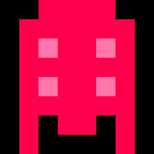
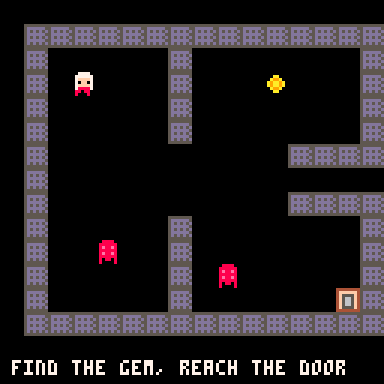
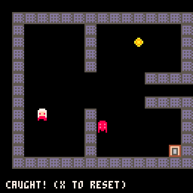
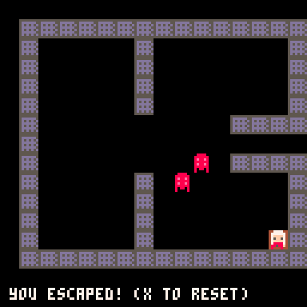

# Building a tiny PICO-8 roguelike with your AI agent + picopilot

> A hands-on tutorial for **driving a coding agent to build a PICO-8 game**. You bring the ideas and the judgement; your agent writes the Lua and draws the sprites; **picopilot is the toolchain that gives the agent what it otherwise lacks on PICO-8** — a way to count tokens, to actually *see* the pixel art it drew, a static verify gate, and now a way to **run the cart on real PICO-8 and look at the running frame**.
>
> Every step below is real: the `picopilot` commands the agent ran, the outputs it got back (pasted verbatim, not paraphrased), the sprite renders it looked at, and the screenshots `picopilot run` captured from actual PICO-8. Where picopilot helped, it says so; where a command surprised us or has a rough edge, it says that too, and every rough edge is collected at the end.
>
> **The companion tutorial:** [`examples/platformer/TUTORIAL.md`](../platformer/TUTORIAL.md) built a platformer and honestly flagged three gaps: no `picopilot run`, a rough `shrinko-failed` message, and the fact that a static sprite render cannot catch context bugs. This tutorial is the sequel: `run`, `lint`, and `minify` now exist, so **the loop is closed** — the agent runs the cart itself and looks at the frame, no human-loads-PICO-8 step. This is the headline improvement.
>
> **The game:** a minimal grid roguelike — an `@`-style hero that moves one tile per keypress (turn-based, `btnp`, not velocity), a tile-map dungeon room with walls that block via map-tile flags (`mget`/`fget`), two enemies that chase, one gem to collect, and a locked exit you can only use once you hold the gem. Deliberately small so the *workflow* is the star.
>
> **Agent-agnostic.** Any coding agent works; the concrete commands are exactly what the agent ran here.

## Why picopilot (the problem it solves)

Coding agents are genuinely good at PICO-8 *Lua logic* — grid movement, a chase AI, a move-as-transaction. Where they fail is everything in the cart's **binary sections**, because the agent can't perceive it, can't safely edit it, and gets no feedback:

- **Token bloat.** PICO-8 caps code at **8,192 tokens**; an agent writes verbose Lua and blows the budget with no cheap way to see where.
- **Blind art.** Sprites are hex blobs. The agent "draws" without ever seeing the result, so pixel art comes out broken and it can't self-correct.
- **No run loop.** Even if the Lua is right, the agent can't boot the cart to confirm it *plays*, or see the running frame.

picopilot turns each cart section into agent-friendly text and closes the loop: `tokens` (the budget), `gfx set`/`gfx show` (edit sprites as a readable grid), `gfx render` (render a sprite to a PNG the agent can **look at**), `lint`/`verify` (static gates), `minify` (reclaim tokens into a *separate* artifact), and `run` (launch on real PICO-8, capture screenshots + `printh`, end on a sentinel). This tutorial exercises the whole surface.

## Setup (how it was invoked here)

This example lives *inside* the picopilot repo, where picopilot is not globally installed, so every command below is the repo's local entry point, run from `packages/picopilot/`:

```sh
node --import tsx src/bin.ts <command> ...
```

(In your own project you would use `npx picopilot <command>` or an installed binary; the commands and their output are identical. Run `npx picopilot skills add` once so your agent discovers the `picopilot-*` skills.)

Two local dependencies, both already in place on this machine:

- **PICO-8** at `~/.AppImages/pico-8/pico8`. `picopilot run` finds it via the `PICO8_PATH` env var, so every run below is prefixed `PICO8_PATH=~/.AppImages/pico-8/pico8`. (Without it, `run` returns a structured `pico8-not-found` result, never a hang.)
- **shrinko8** on `PATH` (`/home/.../.local/bin/shrinko8`). This backs `tokens`, `lint`, `minify`, `verify`, and `gfx export`/`import`. Because it is a real `PATH` entry-point, we never hit the `shrinko-failed` "No module named shrinko8" rough edge the platformer tutorial flagged — a good reminder that the *install method* (a `PATH` binary via `uv tool install shrinko`) is what makes that message go away.

> **On running PICO-8 by hand:** don't. A bare `pico8` (or `pico8 -?`) opens the interactive console and **blocks forever** — it will not auto-close. Always let `picopilot run` own the PICO-8 lifecycle: it launches the cart, captures what it needs, and kills *its own* child process on the sentinel (or a backstop timeout). You can even keep your own PICO-8 open on the side to play; `run` tracks its specific child PID and reads screenshots from an isolated temp dir, so the two never collide.

---

## Step 1 — Scaffold the cart (`init`)

**You:**

> Scaffold a new PICO-8 cart for a small roguelike in `examples/rogue/`.

**The agent runs:**

```sh
node --import tsx src/bin.ts init examples/rogue
```

```
dir: /home/.../examples/rogue
files[4]: main.p8,main.lua,AGENTS.md,picopilot.json
tips[2]: "Skills: make your agent discover picopilot's skills ...","Version control: this folder is not a git repo. ... `init` deliberately does not touch VCS."
```

What the agent now has:

- **`main.p8`** — the cart. Its `__lua__` section is a single `#include main.lua`, so the agent edits plain Lua and never hand-writes the binary sections.
- **`main.lua`** — the source, starting with the standard `_init`/`_update`/`_draw` loop and a `hello picopilot` print.
- **`AGENTS.md`** — a generated PICO-8 reference (API, the 16-colour palette, the memory map + the gfx/map overlap warning, token discipline). The agent loads this as context and writes correct PICO-8 from the first try.
- **`picopilot.json`** — per-cart config (e.g. `allowMapOverlap`).

Notice picopilot did **not** mutate the environment — no `git init`, no global install; it printed tips instead. That "instruct, don't mutate" stance keeps you in control of your repo.

A token check on the empty scaffold, just to prove the gate is live from frame one:

```sh
node --import tsx src/bin.ts tokens examples/rogue/main.p8
```

```
tokens: 17
pct: 0
chars: 241
compressed: 181
budget: 8192
overBudget: false
```

17 / 8,192. Onward.

---

## Step 2 — The game logic (grid movement, map collision, enemies)

This is what agents are *good* at. You describe the game; the agent writes the Lua. The `picopilot-code` skill ships a `reference/puzzle-grid.md` and `reference/top-down-adventure.md` whose idioms fit a roguelike — the agent used them as a starting point and wrote original code:

- **State is a grid, not a pixel.** The player is `{c,r}` (integer cell), rendered at `c*8`, moved by exactly ±1.
- **Input is discrete.** `btnp` (fires once per press), never `btn` (which would rocket the player across the room).
- **A move is a transaction.** Compute the target cell, test it (wall? gem? exit? enemy?), and only then commit.
- **Walls come from the real tilemap.** The room is authored as one string per row, stamped into `__map__` with `mset` in `_init`, and collision is `solid(c,r) = fget(mget(c,r),0)` — a genuine `mget`/`fget` flag lookup, not a hardcoded rectangle.
- **Enemies take a turn after the player.** Each enemy steps one tile toward the player (dominant axis first), refusing walls and other enemies. Catch = an enemy sharing the player's cell.

The room, as the agent authored it (`#`=wall `.`=floor `@`=start `g`=gem `e`=exit `m`=enemy):

```
###############
#.....#.......#
#.@...#...g...#
#.....#.......#
#.....#.......#
#..........####
#..............
#..........####
#.....#.......#
#..m..#.......#
#.....#.m.....#
#.....#......e#
###############
```

(See the committed `main.lua` for the full ~130 lines; the shape is: `_init` stamps the room + spawns actors, `take_turn(dc,dr)` is the transaction, `step_enemy` is the chase, `_draw` paints `map()` then the actors.)

### The token check after the first real version

```sh
node --import tsx src/bin.ts tokens examples/rogue/main.p8
```

```
tokens: 541
pct: 7
chars: 3517
compressed: 1527
budget: 8192
overBudget: false
```

541 / 8,192 (7%). Loads of headroom. The value isn't the number on a tiny cart; it's that the agent now catches "you just blew the budget" the moment it happens.

> **A design note, not a picopilot one:** the map is built at runtime with `mset` from the room string, so the `.p8` on disk has **no `__map__` section** — the tilemap only exists once the cart runs. That's a legitimate PICO-8 pattern (a compact, readable, diff-friendly level), and it matters later (Step 6) when `gfx import` touches the cart's sections.

---

## Step 3 — Draw the sprites (the "agent gets eyes" loop)

The step picopilot exists for. An agent is **blind** to sprite hex. picopilot fixes that with `gfx set` (write a sprite as a readable char grid) and `gfx render` (render it to a PNG the agent can **look at** and correct).

The cart needs five sprites: wall (1), enemy (2), gem (3), exit door (4), hero (5). Floor stays sprite 0 (blank) on the black `cls(0)` background. Here is the wall, as a char grid (`5`=dark-grey, `d`=lavender):

```sh
node --import tsx src/bin.ts gfx set 1 "55555555
5dddddd5
5d5d5d5d
5dddddd5
5d5d5d5d
5dddddd5
5d5d5d5d
55555555" examples/rogue/main.p8
```

```
sprite: 1
aliasesMap: false
overwroteSharedData: false
note: null
```

The hero and enemy were drawn the same way, then the agent **rendered and looked**:

```sh
node --import tsx src/bin.ts gfx render 5 examples/rogue/main.p8
# png: examples/rogue/main-sprite-5.png  (256x256, upscaled, palette-accurate)
```

### Attempt 1 — a black outline that vanishes

The agent's first hero used a black (`0`) outline. The render:


**Not good — and the agent can now SEE why.** The `0` outline is invisible against the black `cls(0)` background, so the hero reads as a floating peach block with a black letterbox "mouth" (the `0f00f0` eye row became one wide slot) and disconnected legs. *None of this is visible in the hex.* This is the exact same class of bug the platformer tutorial hit (a floating head) — a colour that disappears against its background is the single most common blind-sprite failure, and only *looking* catches it.

### Attempt 2 — drop the outline, fix the eyes

The agent removed the black outline (let the white/peach/red read on black directly) and, after one more look, made the eye row symmetric (`70ff07` — two eyes framed by face):

```sh
node --import tsx src/bin.ts gfx set 5 "..7777..
.777777.
.7ffff7.
.70ff07.
.7ffff7.
.788887.
.88.88..
.8...8.." examples/rogue/main.p8
```


**Now it reads as a character:** a white-hooded hero, peach face, two clear eyes, a red body, two legs. The enemy got the same treatment and reads as a classic red ghost/slime:



The gem and door read correctly on the first render (a faceted yellow gem; a brown-framed grey door), so they shipped as-is. The agent got the hero right in three look-and-fix cycles — exactly the `render → set → render` loop, and the whole point of picopilot in two screenshots.

> **Gotcha — `gfx show` conflates black with transparent.** Reading the finished hero back with `gfx show 5` returns the grid with the eye row as `.7.ff.7.` — the black (`0`) eyes come back as `.` (transparent). The pixels *are* black in the `__gfx__` hex (verified by eye), and they render black-on-peach correctly; it's the readback that's lossy: a real `0` pixel is indistinguishable from transparent in the show grid. Harmless here (the eyes sit on peach, so black reads fine), but if you round-trip a sprite through `show → set` you can silently turn black pixels transparent. Trust the *render*, not the show grid, when black is involved. (Collected at the end.)

---

## Step 4 — First run checkpoint (`run` on real PICO-8)

Static checks can't tell you the room actually draws. Time to boot it. `run` needs the cart to **cooperate**: it can't screenshot an arbitrary frame or quit PICO-8 itself, so you add a tiny debug harness (screenshot on a frame timer, then `printh` the sentinel so `run` kills PICO-8 promptly), run, look, and **remove the harness afterwards**.

The agent added to `_draw`:

```lua
-- __DEBUG__ screenshot+sentinel harness (removed after the checkpoint)
dbg=(dbg or 0)+1
if dbg==20 then extcmd("set_filename","frame_0") extcmd("screen") end
if dbg==25 then printh("__PICOPILOT_DONE__") end
```

then ran (note the `PICO8_PATH` prefix, since PICO-8 is local here):

```sh
PICO8_PATH=~/.AppImages/pico-8/pico8 node --import tsx src/bin.ts run examples/rogue/main.p8
```

```
screenshots[1]: /tmp/picopilot-run-rsntBm/frame_0.png
printh: "RUNNING: .../examples/rogue/main.p8\n__PICOPILOT_DONE__"
exitReason: sentinel
shotDir: /tmp/picopilot-run-rsntBm
```

`exitReason: sentinel` — PICO-8 launched headless, took the shot, printed the sentinel, and `run` killed it immediately. The agent opened the PNG:



**The dungeon renders on the first run:** grey brick walls, the two interior dividers, the corridor gap on the right, the hooded hero (top-left), the yellow gem (top-right), two red ghosts, the door (bottom-right), and the HUD "find the gem, reach the door". Everything the agent placed in the room string is exactly where it should be. **This is the closed loop the platformer tutorial lacked**: the agent booted the game and looked at the running frame itself, no human-loads-PICO-8 step.

> **Gotcha — the screenshot verb is `extcmd("screen")`, not `extcmd("screenshot")`** (the latter errors "unknown extcmd"), and `extcmd("set_filename","frame_0")` before it names the shot deterministically. Both are easy wrong guesses; the `picopilot-debug` skill spells them out.

---

## Step 5 — Scripted playtest (`run --input`) surfaces a real bug

A screenshot proves it *draws*; only *playing* proves the mechanics. `run --input "..."` feeds a fixed string to the cart as the `-p` launch param (read via `stat(6)`), for a deterministic, no-hands playtest. The agent added a tiny input-replay harness (one move per 6 frames, mapping `l r u d` to moves) alongside the screenshot harness, then scripted a route toward the gem:

```sh
PICO8_PATH=~/.AppImages/pico-8/pico8 node --import tsx src/bin.ts run examples/rogue/main.p8 --input "ddddrrrrrrrruuuu"
```

```
printh: "...\ngem=false pc=3 pr=7\n__PICOPILOT_DONE__"
exitReason: sentinel
```

The `printh` trace (the agent added `printh("gem="..tostr(has_gem).." pc="..player.c.." pr="..player.r)`) tells the story: after `dddd` (down 4) the player was at row 7, but the eight `r` presses moved it **nowhere** — and the frame showed why:



The HUD reads **CAUGHT!** — the bottom-left enemy chased straight into the player before it could reach the gem. Good news: this *proved the chase AI, the catch detection, and the death-lock all work* (once dead, `_update` early-returns and ignores further input, which is why the `r` presses did nothing). Bad news: the game was, as tuned, **unwinnable** — the only cross-corridor funnels the player right past both enemies.

Two separate checkpoints confirmed the mechanics were otherwise correct:

- `--input "rrrr"` from the start ended at `pc=6 pr=3` — the player advanced cols 3→4→5→6 and **stopped at the wall** at col 7. `mget`/`fget`/`solid` collision works exactly right.
- A later run reached the gem and printed `gem=true` — the pickup transaction fires.

### The fix: a design change driven by the run

This is where driving the agent pays off: the run *showed* the game was too hard, so the agent reasoned about the *rules*, not just a number. The fix is a classic roguelike device — **enemies chase at half speed** (every other turn), giving the player room to juke:

```lua
turns+=1
if turns%2==0 then
 for e in all(enemies) do step_enemy(e) end
 check_death()
end
```

plus nudging one enemy off the exact exit-approach column. After the change, the agent scripted a full winning route (grab the gem, then loop down the far column to the door) and ran it:

```sh
PICO8_PATH=~/.AppImages/pico-8/pico8 node --import tsx src/bin.ts run examples/rogue/main.p8 --input "ddddrrrrrrrruuuulllddddddddddrrrrrr"
```

```
printh: "...\ngem=true won=true pc=14 pr=12\n__PICOPILOT_DONE__"
exitReason: sentinel
```

`gem=true won=true` — the complete loop works end to end. The victory frame:



The gem is gone (collected), the hero stands on the door, both enemies are left behind, and the HUD reads "YOU ESCAPED! (X TO RESET)".

> **A finding about scripted playtests:** `run --input` is a *fixed* string decided at launch, and against a live-chasing enemy a naive no-juke route trades blows in any 1-wide corridor. Getting a deterministic *win* script took several iterations of routing around the pursuers — which is exactly the point: the scripted playtest is a great regression check for **mechanics** (does collision work? does pickup fire? does the win trigger?), but authoring a canned *win* against reactive AI is fiddly. For a win check you often reach for a route that avoids the AI entirely rather than out-playing it.

### Remove the harness

Both the screenshot and input-replay debug blocks came out of `main.lua` before the final passes. The cart ships clean.

---

## Step 6 — The static passes (`tokens`, `lint`, `verify`) and the optional commands

With the game working, the agent ran the full static gate on the clean cart:

```sh
node --import tsx src/bin.ts tokens examples/rogue/main.p8
node --import tsx src/bin.ts lint  examples/rogue/main.p8
node --import tsx src/bin.ts verify examples/rogue/main.p8
```

```
tokens: 575    pct: 7    budget: 8192    overBudget: false

findings: []   clean: true   count: 0

status: pass
scope: "static gate: tokens + integrity; passing does NOT mean the cart runs"
checks: { integrity: true, tokens: true }
tokens: 575
cta: "Static checks pass. Now confirm the cart actually boots: picopilot run"
```

**575 / 8,192 tokens, lint clean, verify pass.** Notice how *honest* `verify` is: it passes but explicitly says *passing does NOT mean the cart runs*, and its call-to-action points at `picopilot run` — which, this time, the agent had already done (Step 4/5). The static gate and the run loop are complementary: static catches malformed/over-budget carts cheaply; run catches everything else.

### `minify` — a separate artifact, source untouched

The cart is nowhere near the budget, but the agent demonstrated `minify` to show it behaves like a compiler (writes `<name>.min.p8`, never mutates source):

```sh
node --import tsx src/bin.ts minify examples/rogue/main.p8
```

```
outPath: .../examples/rogue/main.min.p8
beforeTokens: 575
afterTokens: 547
saved: 28
```

Confirmed: `main.p8` still reports 575 tokens after minify (source untouched), and `main.min.p8` is a separate, variable-renamed, whitespace-stripped artifact (547 tokens, -28). On a real cart bumping the budget, this is how you reclaim tokens without changing behaviour. The `.min.p8` is regenerable, so it is `.gitignore`d, not committed.

### `gfx export` / `import` — round-trip, with two sharp edges

The agent exercised the PNG round-trip (useful if you want to touch the spritesheet in an external editor):

```sh
node --import tsx src/bin.ts gfx export examples/rogue/main.p8 --out examples/rogue/sheet-export.png
```

```
outPath: .../examples/rogue/sheet-export.png     # a raw 128x128 RGBA PNG
```

That worked — but only after a stumble worth recording (below). Re-importing the exported sheet preserved every sprite pixel byte-for-byte, so the round-trip is *pixel-clean*. Two rough edges surfaced here, both collected at the end:

1. **`gfx export` takes `--out`, not a positional.** The first attempt, `gfx export main.p8 examples/rogue/sheet-export.png`, **silently ignored** the second positional and defaulted to `main-sheet.png` — which then failed with `output-exists`. `gfx render` *does* take a positional output path, so the inconsistency is an easy trap. The extra positional should probably be rejected, not swallowed.
2. **`gfx import` shortened the `__gfx__` section.** Importing the sheet rewrote `__gfx__` from 128 hex rows down to 8 (it dropped the trailing all-zero rows). The *sprite pixels* were identical, so it's cosmetically lossy rather than destructive — but it is not a byte-faithful round-trip, and on a cart that *did* persist a `__map__`, the interaction with the shared gfx/map region would deserve a much closer look. The agent restored the cart from a pre-import snapshot to keep the committed `.p8` canonical.

### The gfx/map overlap smart-refuse

Finally, the agent poked the overlap guard the platformer tutorial mentions but never triggered. Writing a *non-empty* sprite in the 128-255 range (which aliases `__map__` rows 32-63) and then trying to overwrite it:

```
message: "sprite 130 aliases the shared map region and its current __gfx__ pixels hold
data (64 non-zero); refusing to silently overwrite it. Remedy: pass --allow-map-overlap,
set allowMapOverlap in picopilot.json, or target a sprite 0-127."
```

The guard works exactly as designed: it *permits* a write when the shared region is empty (with an honest note), and *refuses* when real data is at risk, naming the three ways to authorise it. The agent cleared its test sprite with `--allow-map-overlap` and the cart returned to its canonical state.

---

## Step 7 — Wrap-up: what picopilot did, honestly

### The workflow

You'd drive; the agent builds; picopilot gives the agent the senses it lacks on PICO-8:

| Concern | Without picopilot | With picopilot |
| --- | --- | --- |
| **Token budget** | agent writes verbose Lua, discovers the 8,192 cap only when PICO-8 refuses to save | `tokens` after every change — stayed at `575 / 8192 (7%)` the whole time |
| **Pixel art** | agent writes `__gfx__` hex blind, ships a floating peach block | `gfx set` + `gfx render` — the agent **looked at** the broken hero and fixed the vanishing-outline bug it could never see in hex |
| **A static gate** | nothing to check each iteration | `lint` (clean) + `verify` (pass) — honest that "well-formed" is not "runs" |
| **Does it run / play?** | **no way to know** — a human had to load PICO-8 by hand | `run` booted it headless, captured the frame the agent looked at, and `run --input` scripted a playtest that **found the unwinnable-difficulty bug** |
| **Token reclaim** | hand-golf and hope | `minify` → a *separate* `main.min.p8`, source untouched, −28 tokens reported |

The division of labour is the point: the agent was genuinely good at the **Lua logic** (grid transaction, chase AI, per-turn resolution) and did it fluently; picopilot covered the **binary/perception/run gaps** where agents are otherwise blind.

The single biggest jump over the platformer tutorial: **the run loop closes on the agent.** There, every "does it play?" was a human loading PICO-8. Here, `run` + `run --input` let the agent boot the cart, *look at the frame*, read the `printh` trace, and let a real result (an unwinnable layout) reshape the game's design. That is the whole promise of the toolchain, and it now holds end to end.

## Rough edges found (the real payoff of dogfooding)

Every one of these is a candidate `work/notes/observations/` item or future task. They are the honest cost of building for real:

1. **`gfx show` conflates black (`0`) with transparent (`.`).** A real black pixel round-trips through `gfx show` as `.`. Harmless when you're only *reading*, but a `show → edit → set` round-trip silently turns black pixels transparent. The render is faithful; the show grid is not, for color 0. *Candidate: make `show` distinguish `0` from `.` (or document the lossiness loudly).*

2. **`gfx export` silently swallows an extra positional arg.** `gfx export cart out.png` ignores `out.png` and defaults to `<name>-sheet.png` (then fails `output-exists`). The correct form is `--out out.png`. But `gfx render` *does* take a positional output path — so the two commands disagree, and the wrong guess fails confusingly instead of erroring on the unexpected argument. *Candidate: reject the extra positional, or accept it for parity with `render`.*

3. **`gfx import` is not a byte-faithful round-trip.** Importing an exported sheet rewrote `__gfx__` from 128 hex rows to 8 (dropping trailing zero-rows). Sprite pixels survive, so it's cosmetic, but it mutates the section's on-disk shape, and the interaction with the shared gfx/map region on a map-bearing cart is unexplored. *Candidate: preserve section length on import, and add a test for import into a cart that has a real `__map__`.*

4. **The map/gfx overlap guard blocks a blank-out too.** Once a sprite in the 128-255 range holds data, even *clearing* it (writing all-transparent) is refused without `--allow-map-overlap`. Correct and safe, but mildly surprising when you're trying to *undo* an accidental write. *Candidate: none needed, just worth documenting; the refuse message is excellent.*

5. **Scripted `run --input` wins are fiddly against reactive AI.** The one-shot fixed string is perfect for **mechanics** regression (collision, pickup, the win trigger all confirmed), but authoring a deterministic *win* against a live-chasing enemy took several routing attempts. Not a picopilot bug — a property of canned input vs reactive AI — but worth knowing before you promise a green scripted playtest. *Candidate: the debug skill could note "script routes that avoid the AI, don't out-play it".*

6. **`run` inherits the user's PICO-8 config, which can litter the launch CWD.** This machine's PICO-8 has `record_activity_log 1` set in `~/.lexaloffle/pico-8/config.txt`, so every cart PICO-8 loads gets appended to a relative `activity_log.txt` — which `run` caused to appear in `packages/picopilot/` (the launch CWD), *outside* the example folder. It's a PICO-8 feature, not a picopilot bug, but it's a surprising side effect of a headless `run`: an unrelated file shows up in your working tree. *Candidate: `run` could launch PICO-8 in an isolated CWD (like it already does for screenshots), or at least note in its result that PICO-8 config side effects land relative to the launch dir.*

7. **(Not a bug, a good default worth flagging.)** `run` names screenshots after the cart (`main_0.png`) when you *don't* call `extcmd("set_filename", ...)`, and after your chosen name when you do. Both are fine; just remember to `set_filename` when you want ordered `frame_0/frame_1` shots to perceive motion.

None of these blocked the build. The two most valuable are **#1 (black-vs-transparent in `show`)** and **#3 (`import` reshaping `__gfx__`)**, because both can *silently* alter a cart the agent believes it left unchanged.

## Extensions to try (drive the agent for each)

The game is a foundation. Natural next asks:

- **A real `__map__` section.** Persist the room to `__map__` (author it in PICO-8's editor or via `mset` + `cstore`) instead of stamping it at runtime — then you meet the shared gfx/map region for real, and rough edge #3 becomes worth re-testing.
- **More rooms.** Multiple 16x16 room regions, snap the camera on edge-cross (the `top-down-adventure` reference's room-streaming idiom).
- **Combat.** Bump-to-attack: stepping into an enemy damages it instead of only dying; add hit points and a HUD counter.
- **Field of view.** Only draw tiles within N cells of the player, for that roguelike fog.
- **Sound.** A pickup blip and a caught sting — via picopilot's **audio** commands (`sfx from-mml`), the v2 authoring surface.

## The finished files

- `main.lua` — the game (~130 readable lines, 575 tokens).
- `main.p8` — the cart (hero/enemy/gem/door/wall sprites in `__gfx__`; the room is stamped at runtime).
- `AGENTS.md` — the generated PICO-8 reference the agent leaned on.
- `picopilot.json` — per-cart config.
- `tutorial-assets/` — the real renders and run screenshots shown above (`player-attempt-1`, `player-final`, `enemy-final`, `start`, `win`).
- `.gitignore` — ignores the regenerable `main-sprite-*.png` renders, `main.min.p8`, and `sheet-export.png`.

Run it any time with:

```sh
PICO8_PATH=~/.AppImages/pico-8/pico8 node --import tsx src/bin.ts run examples/rogue/main.p8
```

(from `packages/picopilot/`), or load `examples/rogue/main.p8` in PICO-8 by hand and play it with the arrow keys.
